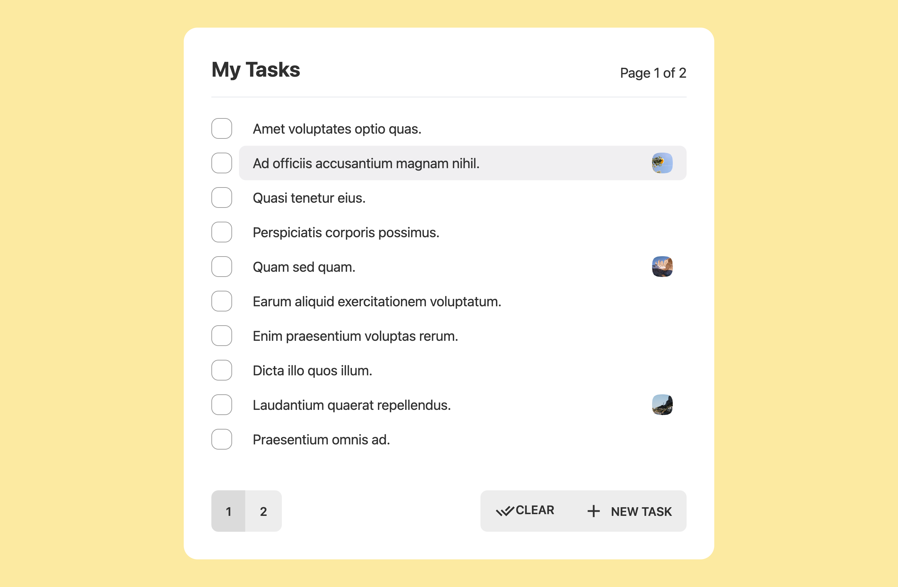

# Todo List Demo with Prim+RPC / Nuxt

<!-- NOTE: StackBlitz doesn't yet support Node 18, required for File usage -->
<!-- [](https://stackblitz.com/github/doseofted/todo-nuxt-prim-rpc-demo/tree/main) -->

This is a simple todo app built with [Nuxt](https://github.com/nuxt/nuxt), [Prisma](https://github.com/prisma/prisma), [Zod](https://github.com/colinhacks/zod), and [Prim+RPC](https://github.com/doseofted/prim-rpc).

## Get Started

First, clone the project:

```zsh
npx giget@latest gh:doseofted/todo-nuxt-prim-rpc-demo
```

This example can be started in development like so:

```zsh
# Copy environment example and set values
cp .env.example .env
echo "DATABASE_URL=\"file:$(pwd)/data/dev.db?connection_limit=1\"" >> .env
# Install deps, prepare database, and start development
npm install && npm run migrate:dev && npm run dev -- --open
```

> **Note**: While Prim+RPC can work in all JavaScript environments, this demo makes use of Node 18+ APIs. You may set your Node version using tools like [`nvm`](https://github.com/nvm-sh/nvm).

This is a simple demo and is not intended to be run in a production environment as-is.

```zsh
# Optionally, preview production-like build:
npm run build && npm run preview
```

## Structure

- Prim+RPC functions can be found in [`./functions/index.ts`](./functions/index.ts).
- Functions are accessed over Nuxt's [Nitro](https://github.com/unjs/nitro) server in the route defined at [`./server/api/[...].ts`](./server/api/[...].ts).
- The client is configured in a composable defined at [`./composables/backend.ts`](./composables/backend.ts).
- This client is named `backend` and is used [throughout the app](./pages/index.vue).

## Explore Prim+RPC

A simple, bare bone example demonstrating [Prim+RPC](https://prim.doseofted.me/) usage with Nuxt can be found in the [fullstack example](https://github.com/doseofted/prim-rpc-examples/tree/main/fullstack-framework).
